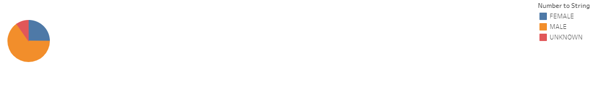
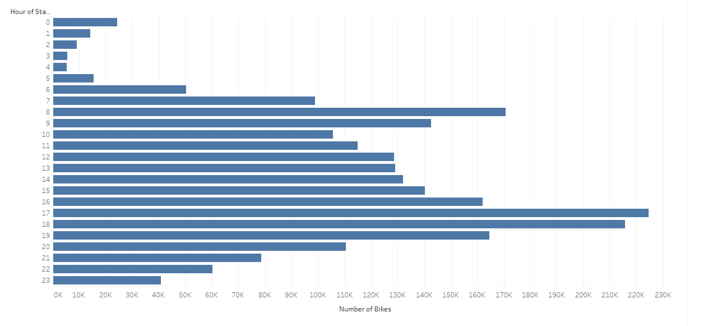
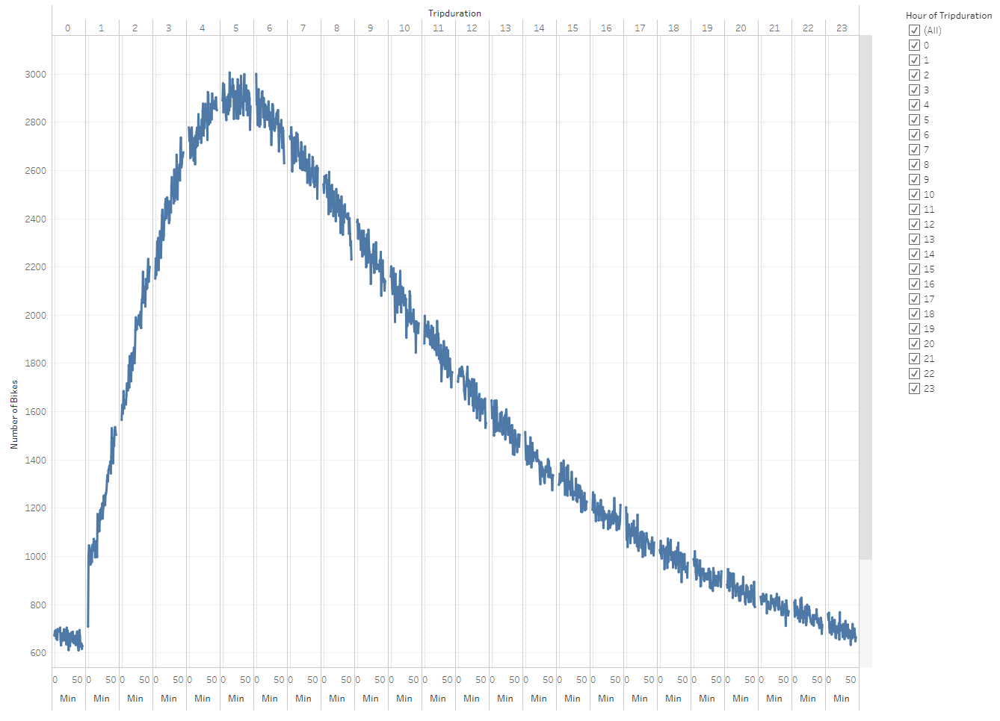
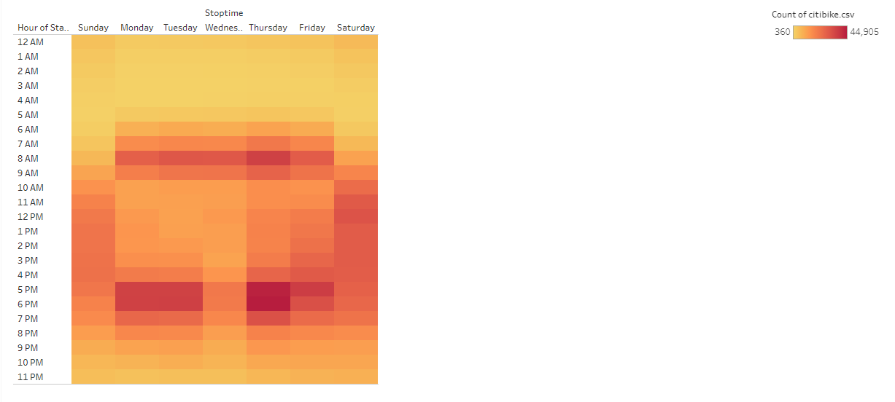
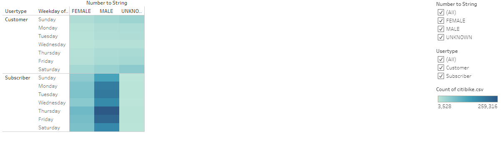

# Bikesharing

## Overview of analysis
The purpose of this analysis is to convince investors that a bike-sharing program in Des Moines is a solid Business Model. To solidify the proposal, Tableau was used to provide bike trip analytic and visualization to pitch to investors.

## Results
The following visualization and Tableau stories can be identified in https://public.tableau.com/profile/toai.nguyen.nguyen#!/vizhome/Module14Challenge_16099104212850/Story1?publish=yes

### Gender Breakdown in the Bike-Sharing Program in Des Moines

This visualization breaks down the amount of Female vs Male users that are in the Bike-Sharing Program in Des Moines. Based on this pie chart, a majority of the users are Males.

### August Peak Hours by Number of Bikes

This visualization breaks down the Peak Hours of users in the month of August. Based on this bar chart, most of the usage are occurring around 4-7pm.

### Number of Bikes Check-out Based on Trip Duration

This visualization breaks down the number of bikes used based on the trip duration. Based on this chart, most of trip usages are at 5 hours.

### Number of Bikes Check-out Based on Trip Duration by Gender

This visualization breaks down the number of bikes used based on the trip duration and gender. Based on this chart, Male ride bikes more often than Female.

### Number of Trips by Weekday per Hour

This visualization is a heatmap of the highest frequency of bike rides based on Weekday and Hour. Based on the heatmap, the largest number of trips are done Thursday evenings between 5 and 7pm.

### Number of Trips by Weekday for Each Hour by Gender

This visualization is a heatmap of the highest frequency of bike rides based on Weekday and Hour, split up by Gender. Based on this heatmap, the highest amount of checkout is on Thursday from 5pm to 7pm. Males are still checking out more bikes than female.

### Number of Trips by Usertype and Gender based on Weekday

This visualization is a heatmap of the highest frequency of bike rides based on usertype (customer/subscriber), split up by Gender. Based on this heatmpa, the highest amount of checkout are from Male Subscribers on Thursday and Friday. Overall, there are more frequent male/female subscribers that check out bikes than normal male/female customer. 

## Summary
